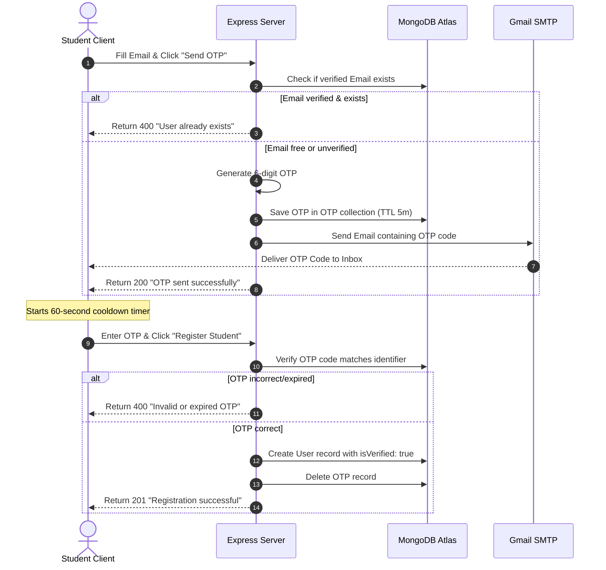

# Smart Placement Management System (SPMS) - Technical Documentation

This document provides a comprehensive technical overview, folder structure, API routing guide, database schema design, authentication flow, and deployment checklist for the **Smart Placement Management System (SPMS)**.

---

## 1. Project Directory Structure

### 1.1 Frontend (`20-management-system`)
```text
20-management-system/
├── public/                 # Static assets accessible directly
├── src/
│   ├── Admin/              # Admin Portal Components
│   │   ├── Add/            # Add Company form
│   │   ├── Applied/        # Student Applications views
│   │   ├── Componentss/    # Sidebar, Recent Activities, Dashboard widgets
│   │   ├── Manage/         # Edit/Delete companies & Drive schedules
│   │   ├── SendNotification/ # Broadcast announcements
│   │   ├── App2.jsx        # Admin root layout/dashboard entry
│   │   └── RegisteredStudents.jsx # Registered Students Directory
│   ├── Components/         # Student Portal & Common Components
│   │   ├── AppliedCompanies/ # Student's job applications
│   │   ├── FindMatchSection/ # Matching logic and results
│   │   ├── Notifications/  # Notifications feed
│   │   ├── Profile/        # Student Profile and academic details
│   │   ├── ViewApply/      # Job description and apply actions
│   │   ├── AdminLogin.jsx  # Admin authentication form
│   │   ├── CompanyCards.jsx # Main placement card grids
│   │   ├── Data.jsx        # Dashboard stats and search layout
│   │   ├── Eligible.jsx    # Quick eligibility indicator
│   │   ├── Findmatch.jsx   # Match trigger buttons
│   │   ├── ForgotPassword.jsx # Recovery multi-step flow
│   │   ├── Login.jsx       # Student Login & Inline OTP Registration
│   │   ├── Navbar.jsx      # Navigation bar
│   │   ├── SearchCompanies.jsx # Filters
│   │   ├── Upcoming.jsx    # Schedule list
│   │   ├── UpcomingCompanies.jsx # Drive details
│   │   └── VerifyEmail.jsx # Verification fallback view
│   ├── assets/             # Images, fonts, and local assets
│   ├── api.js              # Axios centralized instance mapping to backend base URL
│   ├── App.css             # Component custom stylesheets
│   ├── App.jsx             # Main Router definitions and state configurations
│   ├── index.css           # Global Tailwind/Vanilla CSS configurations
│   └── main.jsx            # React root mount point
├── package.json            # Frontend dependency specifications
├── vite.config.js          # Vite compilation settings
└── tailwind.config.js      # CSS configuration file
```

### 1.2 Backend (`server`)
```text
server/
├── config/
│   └── db.js               # Strict MongoDB Atlas connection pool configurations
├── controllers/            # Controller Handlers
│   ├── applicationController.js # Handles applying to drives and status changes
│   ├── authController.js   # Handles registration, logins, OTP, and resets
│   ├── companyController.js # Handles company additions, editing, and alerts
│   ├── dashboardController.js # Aggregates placement cell metrics
│   ├── notificationController.js # Dispatches and deletes notifications
│   └── studentController.js # Manages student profiles and documents
├── data/                   # Temporary or backup seed details
├── middleware/             # Express middlewares
│   ├── auth.js             # Protects endpoints (JWT validation, roles authorization)
│   └── upload.js           # Multer disk storage config for PDF resumes & photos
├── models/                 # Mongoose Data Models
│   ├── Application.js      # Applications collection schema
│   ├── Company.js          # Companies collection schema
│   ├── Notification.js     # Notifications collection schema
│   ├── OTP.js              # OTP code collection schema (with 5-minute TTL)
│   └── User.js             # Student/Admin profiles collection schema
├── routes/                 # Express API Endpoint Maps
│   ├── applicationRoutes.js
│   ├── authRoutes.js
│   ├── companyRoutes.js
│   ├── dashboardRoutes.js
│   ├── notificationRoutes.js
│   └── studentRoutes.js
├── uploads/                # Local uploads folder (resumes, marksheets, photos)
├── .env                    # Active local environment variables
├── .env.example            # Configuration boilerplate placeholders
├── package.json            # Backend dependency specifications
└── server.js               # Express application listener & server entry
```

---

## 2. Dependencies & Framework Specs

### 2.1 Frontend Dependencies
* **`react`** & **`react-dom`** (`v19.2.0`): Building user interfaces with components, hooks (`useState`, `useEffect`, `useRef`), and state updates.
* **`react-router-dom`** (`v7.18.2`): Managing client-side routing, route protections, redirects, and query parameter parsing.
* **`axios`** (`v1.18.1`): Centralized HTTP client configured with request interceptors to automatically attach JWT authorization headers.
* **`lucide-react`** (`v1.27.0`): Premium vector icon set for clean and consistent iconography.
* **`react-circular-progressbar`** (`v2.2.0`): Renders circular indicators for student profile completeness and cgpa ratios.
* **`tailwindcss`** (`v4.3.3`): Utility-first CSS layout engine.

### 2.2 Backend Dependencies
* **`express`** (`v4.19.2`): Fast, minimalist web framework for building HTTP routes and JSON API pipelines.
* **`mongoose`** (`v8.3.1`): Object Data Modeling (ODM) library for MongoDB, enforcing validation, types, and schema checks.
* **`jsonwebtoken`** (`v9.0.2`): Generates and decodes digital signature access tokens (JWT) for authentication.
* **`bcryptjs`** (`v2.4.3`): Secure cryptographic salt-hashing algorithms for passwords.
* **`nodemailer`** (`v9.0.3`): Delivers transactional email alerts (OTPs, forgot password codes, and drive eligibility notifications) via SMTP.
* **`multer`** (`v1.4.5-lts.1`): Middleware for parsing `multipart/form-data` uploads (resumes, marksheets, profile photos).
* **`cors`** (`v2.8.5`): Enables Cross-Origin Resource Sharing settings, restricting frontend API requests to approved domains.
* **`dotenv`** (`v16.4.5`): Loads environment variables from a `.env` file into process context.
* **`nodemon`** (`v3.1.0` - dev): Restarts Node processes automatically when server files change.

---

## 3. Database Collections & Schemas

### 3.1 Users Collection (`User.js`)
Stores profile credentials and academic credentials for both students and placement administrators.
```javascript
{
  name: { type: String, required: true },
  email: { type: String, unique: true, required: false },
  password: { type: String, required: true, select: false },
  role: { type: String, enum: ['student', 'admin'], default: 'student' },
  course: { type: String, default: '' },       // e.g., 'BTech', 'BCA', 'MCA'
  department: { type: String, default: '' },   // e.g., 'CSE', 'IT'
  cgpa: { type: Number, default: 0 },
  skills: { type: [String], default: [] },
  resume: { type: String, default: '' },        // File path
  profilePhoto: { type: String, default: '' },  // File path
  phone: { type: String, unique: true },
  isVerified: { type: Boolean, default: false },
  educationalDetails: {
    class10: {
      schoolName: { type: String, default: '' },
      board: { type: String, default: '' },
      percentage: { type: Number, default: 0 },
      location: { type: String, default: '' },
      marksheet: { type: String, default: '' }
    },
    class12: {
      schoolName: { type: String, default: '' },
      board: { type: String, default: '' },
      percentage: { type: Number, default: 0 },
      location: { type: String, default: '' },
      marksheet: { type: String, default: '' }
    },
    college: {
      semesters: [
        {
          semesterNumber: { type: Number },
          sgpa: { type: Number, default: 0 },
          marksheet: { type: String, default: '' }
        }
      ],
      totalBacklogs: { type: Number, default: 0 },
      ongoingBacklogs: { type: Number, default: 0 }
    }
  }
}
```

### 3.2 Companies Collection (`Company.js`)
Stores recruitment drive details and eligibility thresholds.
```javascript
{
  name: { type: String, required: true },
  description: { type: String, required: true },
  jobDescription: { type: String, required: true },
  role: { type: String, required: true },
  packageLpa: { type: String, required: true },
  location: { type: String, required: true },
  visitDate: { type: Date, required: true },
  lastDateToApply: { type: Date },
  cgpa: { type: Number, required: true, default: 0 },
  minClass10Percentage: { type: Number, default: 0 },
  minClass12Percentage: { type: Number, default: 0 },
  skills: { type: [String], default: [] },
  courses: { type: [String], default: [] },    // e.g., ['BTech', 'MCA']
  rounds: [
    {
      id: { type: Number },
      name: { type: String }
    }
  ],
  logo: { type: String, default: '' },
  status: { type: String, enum: ['Active', 'Closed'], default: 'Active' },
  category: { type: String, enum: ['Tech', 'Sales', 'Other'], default: 'Tech' },
  currentRoundIndex: { type: Number, default: 0 }
}
```

### 3.3 Applications Collection (`Application.js`)
Tracks student applications. An index enforces that a student can only apply to a given company once.
```javascript
{
  studentId: { type: mongoose.Schema.Types.ObjectId, ref: 'User', required: true },
  companyId: { type: mongoose.Schema.Types.ObjectId, ref: 'Company', required: true },
  appliedDate: { type: Date, default: Date.now },
  status: { type: String, enum: ['Pending', 'Shortlisted', 'Rejected', 'Selected'], default: 'Pending' },
  currentRoundIndex: { type: Number, default: 0 }
}
// Unique compound index
applicationSchema.index({ studentId: 1, companyId: 1 }, { unique: true });
```

### 3.4 Notifications Collection (`Notification.js`)
Stores system alerts for students.
```javascript
{
  title: { type: String, required: true },
  message: { type: String, required: true },
  studentId: { type: mongoose.Schema.Types.ObjectId, ref: 'User', required: true },
  readStatus: { type: Boolean, default: false }
}
```

### 3.5 OTP Collection (`OTP.js`)
Stores temporary One-Time Passwords. A TTL index deletes the document 5 minutes (300 seconds) after creation.
```javascript
{
  identifier: { type: String, required: true, lowercase: true },
  otp: { type: String, required: true },
  createdAt: { type: Date, default: Date.now, expires: 300 }
}
```

---

## 4. API Endpoints Map

### 4.1 Authentication & Credentials (`/api/auth`)
| Method | Endpoint | Access | Purpose |
| :--- | :--- | :--- | :--- |
| **POST** | `/api/auth/send-otp` | Public | Dispatches OTP to email for verification. |
| **POST** | `/api/auth/register` | Public | Submits full student signup details + OTP verification inline. |
| **POST** | `/api/auth/admin/register` | Public | Registers a new placement admin. |
| **POST** | `/api/auth/login` | Public | Authenticates credentials and returns JWT + user attributes. |
| **POST** | `/api/auth/resend-otp` | Public | Re-sends registration verification OTP. |
| **POST** | `/api/auth/forgot-password` | Public | Sends a password recovery OTP. |
| **POST** | `/api/auth/verify-forgot-otp`| Public | Validates password reset OTP. |
| **POST** | `/api/auth/reset-password` | Public | Resets password using valid OTP. |
| **GET** | `/api/auth/me` | Protected (JWT) | Retrieves profile of currently authenticated user. |
| **DELETE**| `/api/auth/delete-account` | Protected (JWT) | Permanently deletes student profile and applications. |
| **GET** | `/api/auth/admin/students` | Protected (Admin) | Lists all registered students in the system. |
| **DELETE**| `/api/auth/admin/students/:id` | Protected (Admin) | Deletes a student account by admin. |

### 4.2 Placement Drives (`/api/companies`)
| Method | Endpoint | Access | Purpose |
| :--- | :--- | :--- | :--- |
| **GET** | `/api/companies` | Protected (JWT) | Lists all active placement drives. |
| **GET** | `/api/companies/:id` | Protected (JWT) | Retrieves detailed information of a company drive. |
| **POST** | `/api/companies` | Protected (Admin) | Adds a new company drive & sends email alerts to eligible students. |
| **PUT** | `/api/companies/:id` | Protected (Admin) | Updates details of an existing company drive. |
| **DELETE**| `/api/companies/:id` | Protected (Admin) | Deletes a company drive. |

### 4.3 Student Job Applications (`/api/applications`)
| Method | Endpoint | Access | Purpose |
| :--- | :--- | :--- | :--- |
| **POST** | `/api/applications/apply/:companyId` | Student Only | Applies for a specific placement drive. |
| **GET** | `/api/applications/my-applications` | Student Only | Lists applications submitted by the logged-in student. |
| **GET** | `/api/applications/company/:companyId` | Admin Only | Lists all student applications for a company. |
| **PUT** | `/api/applications/:id/status` | Admin Only | Updates status of an application (e.g. Selected, Shortlisted). |

### 4.4 Student Profile & Document Actions (`/api/students`)
| Method | Endpoint | Access | Purpose |
| :--- | :--- | :--- | :--- |
| **GET** | `/api/students/profile` | Student Only | Fetches detailed academic profile. |
| **PUT** | `/api/students/profile` | Student Only | Updates academic and personal profile details. |
| **POST** | `/api/students/upload-resume` | Student Only | Uploads/updates student's PDF resume. |
| **POST** | `/api/students/upload-photo` | Student Only | Uploads/updates student's profile photo. |
| **POST** | `/api/students/upload-marksheet` | Student Only | Uploads semester or class 10/12 marksheets. |
| **POST** | `/api/students/delete-marksheet` | Student Only | Deletes uploaded marksheet path reference. |
| **GET** | `/api/students/match` | Student Only | Returns placement drives where student satisfies eligibility. |

### 4.5 System Notifications (`/api/notifications`)
| Method | Endpoint | Access | Purpose |
| :--- | :--- | :--- | :--- |
| **GET** | `/api/notifications` | Student Only | Lists notifications of the logged-in student. |
| **POST** | `/api/notifications/read-all` | Student Only | Marks all notifications as read. |
| **DELETE**| `/api/notifications/:id` | Student Only | Deletes a notification from feed. |
| **POST** | `/api/notifications/broadcast` | Admin Only | Broadcasts a custom notification to all students. |

### 4.6 Analytics Dashboard (`/api/dashboard`)
| Method | Endpoint | Access | Purpose |
| :--- | :--- | :--- | :--- |
| **GET** | `/api/dashboard/stats` | Admin Only | Aggregates database stats (Student count, Company count, Placement ratio). |

---

## 5. System Flows & Implementations

### 5.1 Student Signup & OTP Flow


### 5.2 JWT Flow
Authentication uses JWT (JSON Web Tokens) to secure APIs.
1. **Login:** User submits email & password. If authentic, server returns a JWT signed with `JWT_SECRET`.
2. **Storage:** The token is stored in the browser's `localStorage` under `authToken`.
3. **API Communication:** The frontend axios client ([api.js](file:///c:/Placement_management/20-management-system/src/api.js)) uses request interceptors to inspect `localStorage`. If `authToken` is found, it is attached to the request headers:
   `Authorization: Bearer <token>`
4. **Backend Guard Middleware:** The `protect` middleware extracts the token from the `Authorization` header, decodes it using `JWT_SECRET`, retrieves the user record, and mounts it to `req.user`.

### 5.3 File Upload Flow
Documents (resumes, photos, marksheets) are processed on the server using **Multer**:
1. **Request:** Frontend sends files as `multipart/form-data` with JWT headers.
2. **Multer Middleware:** Middleware filters files by mimetype (e.g. `application/pdf`, `image/*`) and writes the file into `server/uploads/` using a unique timestamp filename.
3. **Database Reference:** The controller updates the user document with the file path (e.g., `/uploads/1722510000000-resume.pdf`).
4. **Client Fetching:** Assets are served statically from the `/uploads` directory mapped in `server.js` using `express.static('uploads')`.

---

## 6. Environment Variables Guide

Configure these key-value variables in your **`.env`** file at the root of the `server/` directory:

| Variable | Description | Example / Production Value |
| :--- | :--- | :--- |
| `PORT` | Listening port for the Express application. | `5000` |
| `MONGODB_URI` | Exclusive MongoDB Atlas connection string. | `mongodb+srv://<user>:<password>@cluster.mongodb.net/placement_db` |
| `JWT_SECRET` | Secret key used for signing JWT login tokens. | *Set a long random cryptographic hash string* |
| `EMAIL_USER` | Gmail address used for SMTP email alerts. | `placementmanagement244@gmail.com` |
| `EMAIL_PASS` | 16-character Gmail App Password. | `vkxllhncllbrsgse` |
| `NODE_ENV` | Mode of runtime execution. | `production` |

---

## 7. Production Deployment Guide

### 7.1 Pre-Production Checklist (Changes Required)

> [!IMPORTANT]
> 1. **Centralize Backend Base URL:** Update `c:\Placement_management\20-management-system\src\api.js` to change the `baseURL` from local development `http://localhost:5000` to the actual hosted backend URL on Render (e.g., `https://your-backend.onrender.com`).
> 2. **CORS Configuration:** Configure backend `server/server.js` cors middleware options to only allow requests originating from your hosted Vercel frontend URL, rather than opening to all origins.
> 3. **Change SMTP Emails Link:** In `server/controllers/companyController.js` (lines 53 & 141), change the dynamic redirection links in email templates from `http://localhost:5173/login?redirect=...` to your actual hosted Vercel frontend domain address.
> 4. **Uploads Directory Storage:** Storing uploads locally in `uploads/` will get wiped on Render restarts (since Render dynos have ephemeral file systems). Change file uploads to utilize a cloud storage service like Cloudinary or AWS S3, or keep local directory storage noting that uploads reset periodically on free tier Render deployments.

---

### 7.2 Database configuration (MongoDB Atlas)
1. Log in to MongoDB Atlas and navigate to **Network Access**.
2. Make sure IP access is set to `0.0.0.0/0` (Allow Access from Anywhere) so Render dyno instances can securely connect without IP rejection blocks.
3. Keep the Database user credentials (`akshay` / `Akshay1234`) active.

---

### 7.3 Backend Deployment on Render
1. Create a new account on **Render** (render.com) and link your GitHub repository.
2. Select **New Web Service** and select your repository.
3. Configure settings:
   * **Root Directory:** `server`
   * **Runtime:** `Node`
   * **Build Command:** `npm install`
   * **Start Command:** `node server.js`
4. Under **Environment Variables**, add:
   * `MONGODB_URI`
   * `JWT_SECRET`
   * `EMAIL_USER`
   * `EMAIL_PASS`
   * `NODE_ENV` = `production`
5. Deploy. Copy the hosted URL (e.g., `https://spms-backend.onrender.com`).

---

### 7.4 Frontend Deployment on Vercel
1. Log in to **Vercel** (vercel.com) and click **Add New Project**.
2. Import your GitHub repository.
3. Configure settings:
   * **Framework Preset:** `Vite`
   * **Root Directory:** `20-management-system`
   * **Build Command:** `npm run build`
   * **Output Directory:** `dist`
4. Click **Deploy**. Vercel will host your client and return a URL (e.g., `https://spms-frontend.vercel.app`).

---

### 7.5 Git Commands to Push to GitHub
Run the following commands inside `c:\Placement_management` to push your code changes to GitHub:

```bash
# Initialize git (if not already done)
git init

# Add all files to staging
git add .

# Commit changes
git commit -m "Configure production eligibility matching and dynamic login redirects"

# Add your GitHub repository remote url
git remote add origin https://github.com/your-username/your-repo-name.git

# Push code changes
git branch -M main
git push -u origin main
```

---

## 8. Troubleshooting & Potential Deployment Issues

| Issue | Root Cause | Solution |
| :--- | :--- | :--- |
| **Server selection timeout error** | MongoDB Atlas IP block. | Go to Atlas Console -> Network Access, add `0.0.0.0/0` to allow dyno connection access. |
| **Email fails to send** | Gmail App password missing/incorrect or 2FA disabled. | Create a Gmail App Password in your account dashboard and assign it to `EMAIL_PASS`. Do not use your normal account password. |
| **Uploads missing on server restart** | Render uses ephemeral local storage. | Host uploads on an external file management service like Cloudinary or configure persistent disk volumes on Render settings. |
| **CORS block error on login** | Frontend URL not whitelisted in backend. | Update CORS parameters in backend `server.js` or allow your vercel app domain. |
